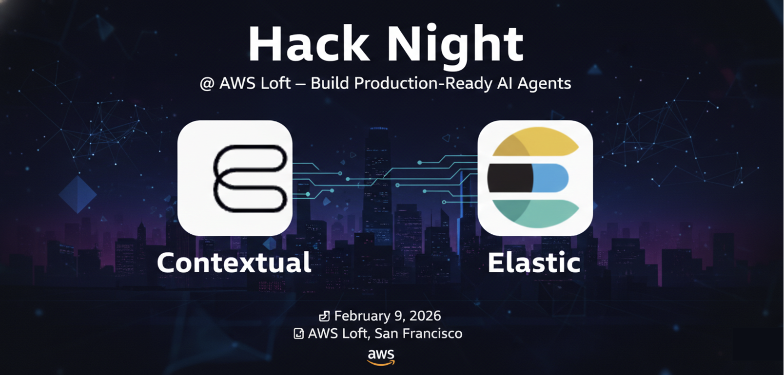

# Elastic x Contextual AI Hack Night

Welcome to the Elastic x Contextual AI Hack Night! Build AI agents powered by Elasticsearch and Contextual AI's RAG platform.

## Event Challenges

### Challenge 1: Quick Start - Agentic Search

**Prize:** First to complete wins!
**Bonus Prize:** Random draw from all completions

Sign up for a **free Contextual AI account** and build your first RAG agent!

| Guide | Description |
|-------|-------------|
| [Quick Start (GUI)](./quickstart-gui.md) | Create an agent using the Platform UI — no code required |
| [Quick Start (API)](./quickstart-api.md) | Create an agent programmatically using Python |

**To submit:** Fill out the [Google Form](https://docs.google.com/forms/d/e/1FAIpQLSdb941rSlQ6s4EcYMu-OwiLkC_jeI-8fD181pYnsbddQnNfTA/viewform) with:
- Your email address
- Screenshot of your agent query results
- Optional: Did you use GUI or API?

---

### Challenge 2: Build Your Own Agent

**Work solo or in teams (up to 3 people)**

Ready to go deeper? We'll add you to our **enterprise tenant** where you can create custom agents with advanced features.

| Guide | Description |
|-------|-------------|
| [Build Your Own Agent](./build-your-own-agent.md) | Customize prompts, explore Agent Composer, and create something unique |

**To participant:** If you submit the Google Form with your email address, you will automatically be added to the tenant. If you do not submit the Google Form with your email address, let an organizer know, and you'll be added to the tenant.

**Judging:** Plan for a 2-3 minute demo of your agent.

| Criteria | What We're Looking For |
|----------|------------------------|
| **Use Case** | Is the problem interesting and well-defined? |
| **Prompt Quality** | Do the prompts produce good, consistent results? |
| **Creativity** | Did you try something unique or innovative? |
| **Demo Quality** | Can you clearly explain what your agent does? |

---

## Resources

- [Contextual AI Platform](https://app.contextual.ai)
- [Contextual AI Documentation](https://docs.contextual.ai)
- [Agent Composer YAML Guide](https://docs.contextual.ai/how-to-guides/agent-composer-yaml)
- [Demo Gallery](https://demo.contextual.ai)
- [Elastic Resources](./ELASTIC_RESOURCES.md)

---

## For Organizers

Event automation scripts are in the [scripts/](./scripts/) folder:

- **[invite_users.py](./scripts/invite_users.py)** — Bulk invite users to tenant from Google Form CSV export

See [scripts/README.md](./scripts/README.md) for usage instructions.

---

## Support

Having issues? Flag down a Contextual AI team member or check the [troubleshooting section](./quickstart-gui.md#troubleshooting).
